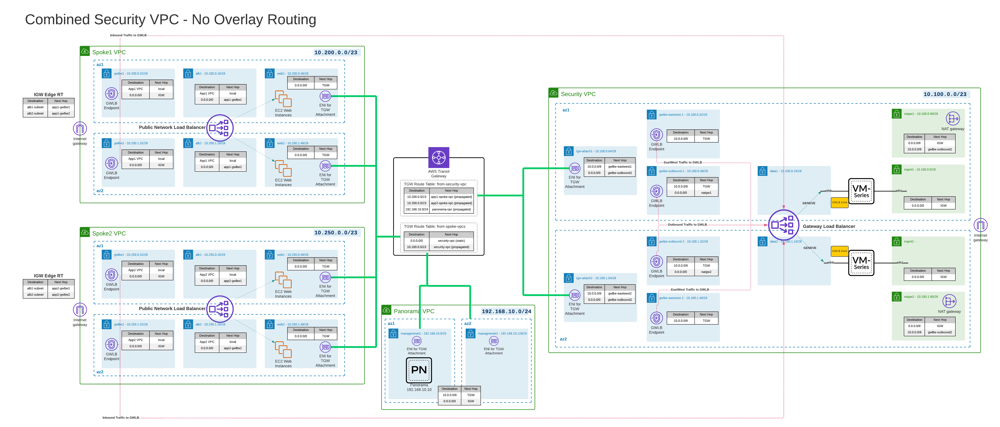

# Palo Alto Firewall Deployment with Gateway Load Balancer

## Prerequisites

1. **Update the `terraform.tfvars` file**:
    - Omit the access/secret access keys if the machine you are using already has AWS access.
    - Comment out `access_key` and `secret_key` in `main.tf` if omitted from the `tfvars` file.
    - Ensure the EC2 SSH keypair is created and downloaded. This will be used for SSH access later.
    - Update the AMI ID. Accept the Palo Alto firewall terms from the marketplace related to the AMI.

2. **Subnet Requirements**:
    - This version expects the following to be in place.
      - 12 Subnets in 2 AZs
        - 2 for Mgmt
        - 2 for North South traffic flow
        - 2 for East West traffic flow
        - 2 for the NAT gateway
        - 2 for the data interface of the palo
        - 2 for the transit gateway attachments

3. **Availability Zones**:
    - 2 AZs are mandatory for the load balancer.

4. **Transit Gateway**:
    - This version expects a transit gateway is already deployed and attached to the 2 txgw subnets.

5. **NAT Gateways**
    - This version expects 2 NAT gateways in 2 AZs to already have been deployed.

## File Structure

The Terraform configuration has been split into multiple files for better organization:

- `main.tf`: Contains initialization and setup configurations.
- `vpc_subnets.tf`: Contains data sources for existing VPC and subnets.
- `route_tables.tf`: Contains data sources for existing route tables.
- `nat_gateway.tf`: Contains data sources for existing NAT gateways.
- `transit_gateway.tf`: Contains resources for transit gateway configuration.
- `routes.tf`: Contains resources for route configurations.
- `locals.tf`: Contains local variables used across the configuration.
- `gwlb.tf`: Contains resources for the loadbalancer.
- `securitygroup.tf`: Contains resources for security groups.

## Topology Diagram



## After Deployment

1. **Configure Each Device**:
    - SSH into each device and execute the following commands to set the admin password and configure the network:

    ```sh
    configure
    set mgt-config users admin password
    set network interface ethernet ethernet1/1 layer3 dhcp-client enable yes
    set network interface ethernet ethernet1/1 layer3 dhcp-client accept-default-route yes
    set network profiles interface-management-profile https-healthcheck https yes
    set network interface ethernet ethernet1/1 layer3 interface-management-profile https-healthcheck
    set zone data network layer3 ethernet1/1
    set network virtual-router default interface ethernet1/1
    commit
    ```

2. **Setup Spoke VPCS**:
    - Traffic is intrazone by default, and Palo Alto allows intrazone traffic. Use security groups to isolate traffic as needed.
    - Spokes should connect to the txgw, with routing handled automatically. Ensure the spoke has a default route to the txgw for private subnets.
    - For public ingress access in spoke subnets:
      - Devices on the public subnet must have public IPs. Use a load balancer if possible.
      - Create a subnet in each AZ for the gateway load balancer endpoints with routes to the IGW and VPC CIDR.
      - Create an ingress subnet/route table attached to the IGW with routes to the appropriate gwlbe for each AZ.
      - Create a public subnet and route table per AZ with routes to the appropriate GLBE and VPC CIDR. Add routes to the transit gateway if needed.
      - Create additional route tables/subnets for private workloads with routes to the txgw.
